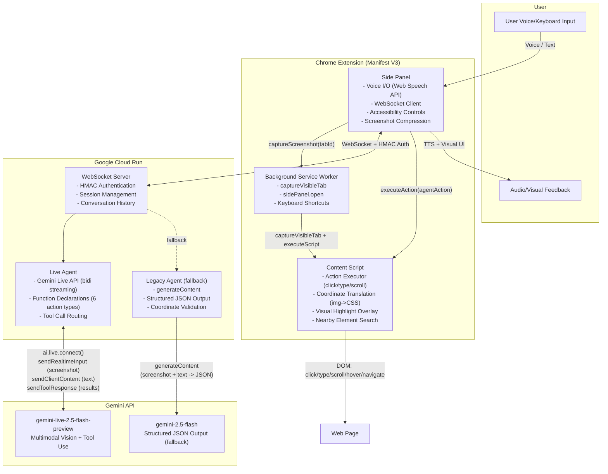

# VoxSight Architecture

## System Overview

## Data Flow

### Live API Mode (Production)

1. **User Input**: Voice (Web Speech API STT) or keyboard text
2. **Screenshot**: Side Panel requests Background SW to call `captureVisibleTab(windowId)` -> JPEG
3. **Compression**: Side Panel resizes to max 1280px width via canvas
4. **Transport**: WebSocket with HMAC auth (timestamp + nonce + SHA-256 signature)
5. **Live Session**: Backend sends screenshot via `sendRealtimeInput()` + text via `sendClientContent()`
6. **Gemini Response**: Model returns text parts (streamed) and/or function calls (tool use)
7. **Action Execution**: Side Panel receives `tool_call`, routes to Content Script via `chrome.tabs.sendMessage`
8. **Content Script**: Translates screenshot coordinates to CSS (`imgCoord / devicePixelRatio`), executes DOM action
9. **Verification**: Post-action screenshot sent back for Gemini to verify result
10. **Feedback**: TTS speaks response text, visual highlight shows action target

### Legacy Mode (Fallback)

Same flow but steps 5-6 use `generateContent` with structured JSON output `{text, actions[]}` instead of bidirectional streaming.

## Security

- **WebSocket Auth**: HMAC-SHA256 with shared secret, timestamp (60s skew), nonce replay protection
- **Extension Permissions**: `activeTab`, `sidePanel`, `tabs`, `scripting`, `storage`, `webNavigation`
- **Screenshot Data**: Compressed JPEG, sent only to own backend, not stored
- **URL Filtering**: Blocks chrome://, about:, devtools://, Chrome Web Store pages

## Accessibility (WCAG 2.1 AA)

- High contrast mode (black background, white text, yellow accents)
- Font size modes (normal 14px / large 18px / xlarge 22px)
- Keyboard shortcuts: Space (push-to-talk), Escape (cancel), Alt+V (toggle), Alt+D (describe)
- Reduced motion support via `prefers-reduced-motion`
- Bilingual support: Chinese, English, Auto-detect

## Tech Stack

| Component | Technology |
|-----------|-----------|
| Extension | Chrome MV3, TypeScript, esbuild |
| Backend | Node.js 18, TypeScript, WebSocket (ws) |
| AI Model | Gemini Live API (gemini-live-2.5-flash-preview) |
| AI SDK | @google/genai (TypeScript) |
| Deployment | Google Cloud Run, Docker |
| Voice I/O | Web Speech API (STT + TTS) |
| Auth | HMAC-SHA256 |
